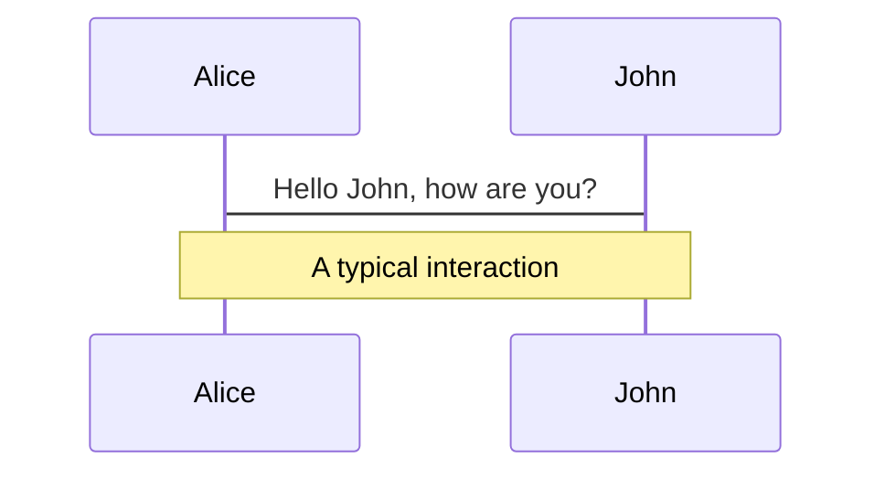
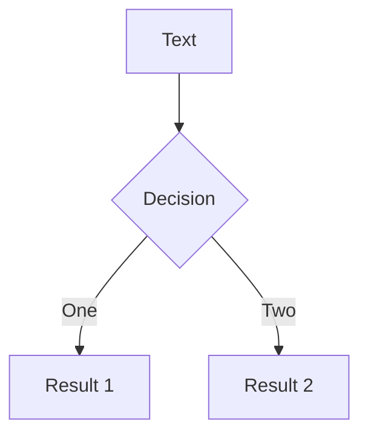
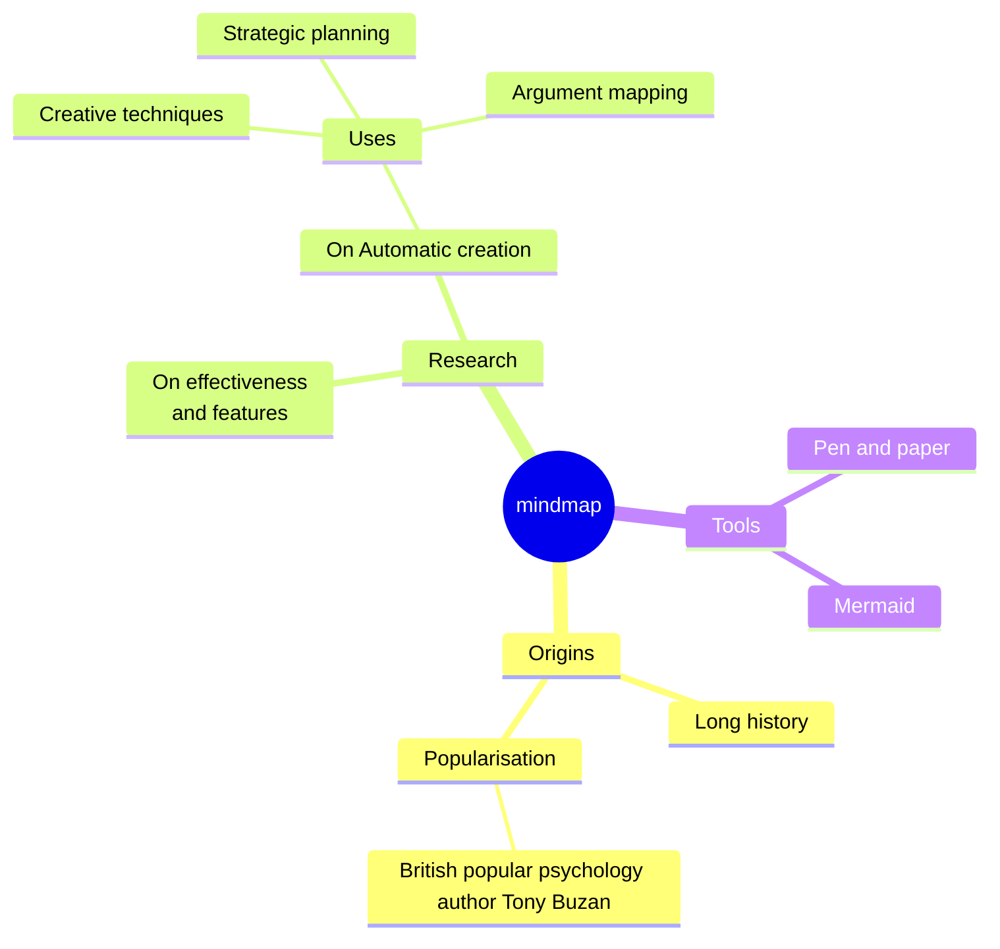
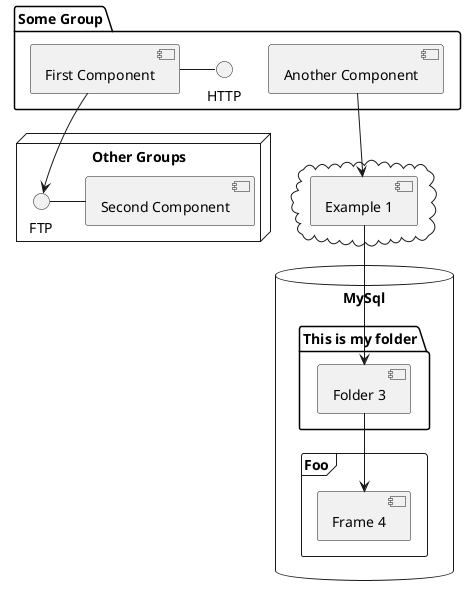

# Slidev Theme Onecraft

A Capgemini Onecraft template for developers

<div class="uppercase text-sm tracking-widest">
Yohann Ciurlik
</div>

<div class="abs-bl mx-14 my-12 flex">
  
  <div class="ml-3 flex flex-col text-left">
        <div><b>Digital Customer eXperience</b></div>
    <div class="text-xs opacity-50">01 avril 2025</div>
  </div>
</div>

---
layout: cover
logo: '/logos/logo_onecraft_fond_couleur.png'
background: "/backgrounds/background8.jpeg"
---

# Slidev Theme Onecraft

Another cover exemple

<div class="uppercase text-sm tracking-widest">
Yohann Ciurlik
</div>

<div class="abs-bl mx-14 my-12 flex">
  
  <div class="ml-3 flex flex-col text-left">
        <div><b>Digital Customer eXperience</b></div>
    <div class="text-xs opacity-50">01 avril 2025</div>
  </div>
</div>

---
layout: cover
logo: '/logos/logo_onecraft_fond_couleur.png'
background: "/backgrounds/background13.jpeg"
---

# Slidev Theme Onecraft

Another cover exemple

<div class="uppercase text-sm tracking-widest">
Yohann Ciurlik
</div>

<div class="abs-bl mx-14 my-12 flex">
  
  <div class="ml-3 flex flex-col text-left">
        <div><b>Digital Customer eXperience</b></div>
    <div class="text-xs opacity-50">01 avril 2025</div>
  </div>
</div>

---
layout: cover
logo: '/logos/logo_onecraft_fond_couleur.png'
background: '#272936'
---

# Slidev Theme Onecraft

Another cover exemple with a gray background

<div class="uppercase text-sm tracking-widest">
Yohann Ciurlik
</div>

<div class="abs-bl mx-14 my-12 flex">
  
  <div class="ml-3 flex flex-col text-left">
        <div><b>Digital Customer eXperience</b></div>
    <div class="text-xs opacity-50">01 avril 2025</div>
  </div>
</div>

---
layout: cover
logo: '/logos/logo_capgemini_blanc.svg'
background: "/backgrounds/background5.jpeg"
dimmed: true
---

# Slidev Theme Onecraft

Capgemini cover exemple

<div class="uppercase text-sm tracking-widest">
Yohann Ciurlik
</div>

<div class="abs-bl mx-14 my-12 flex">
  
  <div class="ml-3 flex flex-col text-left">
        <div><b>Digital Customer eXperience</b></div>
    <div class="text-xs opacity-50">01 avril 2025</div>
  </div>
</div>


---
layout: image-right
image: 'bulb.jpg'
---

# Template agenda

A layout with image on the right

- Introduction
- A topic
- Another topic
- Yet another topic
- Outro

---
layout: 'presenter'
presenterImage: 'https://avatars.githubusercontent.com/u/107427?v=4'
--- 

# Yohann Ciurlik

Solution architect at <a  href="https://www.capgemini.com/"><mdi-cards-spade mr-1 /> Capgemini</a>

- Paris, France 🇫🇷
- I often write at <a href="https://medium.com/@spawnrider">medium.com/@spawnrider</a>
- Github porfolio at <a href="https://github.com/spawnrider"><logos-github-icon mr-1/>spawnrider</a>
- Say hi at <a href="https://bsky.app/profile/yohann.ciurlik.fr"><logos-bluesky mr-1 />@yohann.ciurlik.fr</a>

---
layout: image-right
image: https://images.unsplash.com/photo-1535223289827-42f1e9919769?q=80&w=2574&auto=format&fit=crop
---

# Slidev Theme Starter

Presentation slides for developers

<div class="pt-12">
  <span @click="$slidev.nav.next" class="px-2 py-1 rounded cursor-pointer" flex="~ justify-center items-center gap-2" hover="bg-white bg-opacity-10">
    Press Space for next page <div class="i-carbon:arrow-right inline-block"/>
  </span>
</div>

---
background: '/backgrounds/background12.jpeg'
---

# What is Slidev?

Slidev is a slide maker and presentation tool designed for developers. It includes the following features:

- 📝 **Text-based** - focus on your content with Markdown, then style it later
- 🎨 **Themable** - themes can be shared and reused as npm packages
- 🧑‍💻 **Developer Friendly** - code highlighting, live coding with autocompletion
- 🤹 **Interactive** - embed Vue components to enhance your expressions
- 🎥 **Recording** - built-in recording and camera view
- 📤 **Portable** - export to PDF, PPTX, PNGs, or even a hostable SPA
- 🛠 **Hackable** - virtually anything that's possible on a webpage is possible in Slidev

<br>
<br>

Read more about [Why Slidev?](https://sli.dev/guide/why)

---
background: '/backgrounds/background9.jpeg'
---

# Navigation

Hover on the bottom-left corner to see the navigation's controls panel

## Keyboard Shortcuts

|                                                      |                             |
| ---------------------------------------------------- | --------------------------- |
| <kbd>space</kbd> / <kbd>tab</kbd> / <kbd>right</kbd> | next animation or slide     |
| <kbd>left</kbd> / <kbd>shift</kbd><kbd>space</kbd>   | previous animation or slide |
| <kbd>up</kbd>                                        | previous slide              |
| <kbd>down</kbd>                                      | next slide                  |

---
layout: image-right
image: https://cover.sli.dev
---

# Code

Use code snippets and get the highlighting directly!

```ts {all|5|7|7-8|10|all} twoslash
// TwoSlash enables TypeScript hover information
// and errors in markdown code blocks
// More at https://shiki.style/packages/twoslash

import { computed, ref } from 'vue'

const count = ref(0)
const doubled = computed(() => count.value * 2)

doubled.value = 2
```

---

# Diagrams

You can create diagrams / graphs from textual descriptions, directly in your Markdown.

<div class="grid grid-cols-4 gap-5 pt-4 -mb-6">









</div>

Learn more: [Mermaid Diagrams](https://sli.dev/features/mermaid) and [PlantUML Diagrams](https://sli.dev/features/plantuml)


---
layout: text-image
media: 'https://media3.giphy.com/media/v1.Y2lkPTc5MGI3NjExY2Izd3EzZnhvY2ZxM2wydHN6aGwzeXZldG9wanVkMzBvd3l4MHgyMyZlcD12MV9pbnRlcm5hbF9naWZfYnlfaWQmY3Q9Zw/13rQ7rrTrvZXlm/giphy.gif'
caption: 'It''s incredible'
---

# Quick introduction 🚀

Arepa ipsum dolor amet jalabola! aenean sit tequeños se prendio esta chamito;? Nisl nojoda eu amet in? Nisl cuál es la guachafita ni lava ni presta la batea háblame cloro gravida sifrino macundal panita; Sed háblame cloro nunc empanada ac coroto Na webona vladimil parchita?

- Cacique panita sit Se prendio la labia gravida Praesent tequeño.
- Qué paso mi pana?! elit parchita molleja aguacate vergación, háblame mollejúo chamito est burda mauris morbi;

---
layout: text-image
reverse: true
media: 'https://media3.giphy.com/media/v1.Y2lkPTc5MGI3NjExY2Izd3EzZnhvY2ZxM2wydHN6aGwzeXZldG9wanVkMzBvd3l4MHgyMyZlcD12MV9pbnRlcm5hbF9naWZfYnlfaWQmY3Q9Zw/13rQ7rrTrvZXlm/giphy.gif'
---

# This is a reverse style

Arepa ipsum dolor amet jalabola! aenean sit tequeños se prendio esta mierdaa menool ladilla chamito;? Nisl nojoda eu amet in

---
layout: new-section
---

# New wild section appeared


---
layout: two-cols
---
Awiwiiw

```vue
// Model.vue
<script setup lang="ts">
import { useAnimations, useGLTF } from '@tresjs/cientos'

const { scene: model, animations } = await useGLTF(
  'models/ugly-bunny.gltf',
)

const { actions, mixer } = useAnimations(animations, model)
const currentAction = ref(actions.Greeting)
currentAction.value.play()
</script>

<template>
  <primitive :object="model" />
</template>
```

::right::

```vue
<template>
  <TresCanvas
    clear-color="”#82DBC5”"
    window-size
  >
    <TresPerspectiveCamera />
    <Suspense>
      <Model />
    </Suspense>
  </TresCanvas>
</template>
```

---
layout: two-thirds
---
Awiwiiw

```vue
// Model.vue
<script setup lang="ts">
import { useAnimations, useGLTF } from '@tresjs/cientos'

const { scene: model, animations } = await useGLTF(
  'models/ugly-bunny.gltf',
)

const { actions, mixer } = useAnimations(animations, model)
const currentAction = ref(actions.Greeting)
currentAction.value.play()
</script>

<template>
  <primitive :object="model" />
</template>
```

::right::

```vue
<template>
  <TresCanvas
    clear-color="”#82DBC5”"
    window-size
  >
    <TresPerspectiveCamera />
    <Suspense>
      <Model />
    </Suspense>
  </TresCanvas>
</template>
```

---
layout: text-window
---

# Consoles

Use code snippets and get the highlighting directly into a nice looking window!

::window::

```ts
// main.ts

import { createDynamicForms } from '@asigloo/vue-dynamic-forms'
import { createApp } from 'vue'

const VueDynamicForms = createDynamicForms({
  // Global Options go here
})

export const app = createApp(App)

app.use(VueDynamicForms)
```
---
layout: text-window
reverse: true
---

# Embedded stuff

Use window to show a live demo of any page, or even a sub component!

::window::

<div class="overflow-hidden relative w-full aspect-16-9">
<iframe height="300" style="width: 100%;" scrolling="no" title="Text Clock" src="https://codepen.io/searleb/embed/VYwRYEw?default-tab=result%2Cresult" frameborder="no" loading="lazy" allowtransparency="true" allowfullscreen="true">
</iframe>
</div>

---
layout: center
class: "text-center"
---

# Learn More

[Documentation](https://sli.dev) · [GitHub](https://github.com/slidevjs/slidev) · [Showcases](https://sli.dev/resources/showcases)
[Onecraft template](https://github.com/spawnrider/slidev-theme-onecraft)

<PoweredBySlidev mt-10 />
